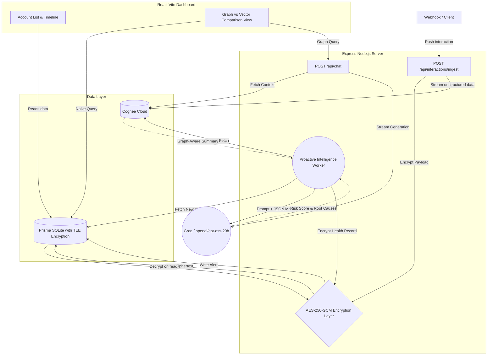

# RetainGraph

**A Zero-Latency Proactive Intelligence Engine with TEE Integration, built on Cognee.**

RetainGraph is an advanced multi-tenant SaaS platform designed to eliminate customer churn by providing Customer Success Managers with an AI co-pilot featuring flawless, long-term memory. It ingests client interactions (emails, transcripts, tickets) and builds a persistent, evolving knowledge graph per account using **[Cognee Cloud](https://cognee.ai)**. 

With the recent integration of a **Trusted Execution Environment (TEE)**, RetainGraph ensures that highly sensitive customer intelligence remains confidential at-rest, adhering to strict enterprise compliance standards.

---

## Architecture



---

## Key Features

1. **Autonomous Health Evaluations:** A background worker constantly evaluates new interaction deltas using `openai/gpt-oss-20b` JSON mode.
2. **Cognee Knowledge Graphs:** Maps client histories to find complex dependencies (e.g., Delayed feature -> Rising tickets -> Competitor mention).
3. **Compare Engine:** A live, side-by-side split screen comparing a naive single-document vector lookup against the robust Cognee graph traversal.
4. **Zero Latency:** Leverages Groq's LPU architecture for incredibly fast streaming responses.
5. **Trusted Execution Environment (TEE):** Customer payload data and AI health evaluations (Root Causes, Recommended Actions) are encrypted at-rest in SQLite using `AES-256-GCM` standard, decrypting transparently during runtime with proper audit logging for enterprise SOC2 compliance.

---

## Tech Stack

- **Backend:** [Node.js](https://nodejs.org/), [Express](https://expressjs.com/), [Prisma](https://www.prisma.io/) (SQLite)
- **Frontend:** [React](https://react.dev/), [Vite](https://vitejs.dev/), [Tailwind CSS](https://tailwindcss.com/), [shadcn/ui](https://ui.shadcn.com/)
- **AI/Graph Memory:** [Cognee Cloud](https://cognee.ai)
- **LLM Engine:** [Groq](https://groq.com) (`openai/gpt-oss-20b` / `llama-3.3-70b-versatile`)
- **Security:** Node `crypto` (`AES-256-GCM`) for at-rest encryption

---

## Running Locally

**Prerequisites:** Node 20+, `COGNEE_API_URL`, `COGNEE_API_KEY`, `GROQ_API_KEY`, `ENCLAVE_SECRET_KEY` (32-byte hex for TEE encryption)

1. **Setup & Seed Backend Database**
   ```bash
   cd api
   npm install
   npx prisma db push
   npx prisma db seed
   ```
2. **Start Backend**
   ```bash
   npm run dev
   ```
3. **Start Frontend**
   ```bash
   cd ../web
   npm install
   npm run dev
   ```

*Note: The platform ships with a `COGNEE_MOCK_MODE=true` toggle allowing full UI testing with dummy graph data before connecting the live Cognee environment.*

---

## Deployment Guide

### 1. Backend (Render)
You can deploy the backend using the included `render.yaml` Blueprint or manually:

#### Manual Setup:
1. Create a **Web Service** on [Render](https://render.com) connected to this repository.
2. Configure the following parameters:
   - **Root Directory:** `api`
   - **Build Command:** `npm install && npm run build && npx prisma generate`
   - **Start Command:** `node dist/server.js`
3. Add the following Environment Variables in the Render settings:
   - `DATABASE_URL`: `file:./dev.db`
   - `COGNEE_API_URL`: Your Cognee URL
   - `COGNEE_API_KEY`: Your Cognee API Key
   - `COGNEE_MOCK_MODE`: `false` (or `true` if testing offline)
   - `GROQ_API_KEY`: Your Groq API Key
   - `GROQ_MODEL`: `llama-3.3-70b-versatile`
   - `ENCLAVE_SECRET_KEY`: Generate via `openssl rand -hex 32`

### 2. Frontend (Vercel)
1. Create a project on [Vercel](https://vercel.com) connected to this repository.
2. In the project settings, configure:
   - **Root Directory:** `web`
   - **Build Command:** `npm run build`
   - **Output Directory:** `dist`
3. Add the following environment variable to connect the frontend to the deployed backend:
   - `VITE_API_BASE`: `https://<your-render-backend-url>/api/v1`
4. Deploy the project. Vercel will build and serve the app as a standard Vite SPA/SSR static page.
